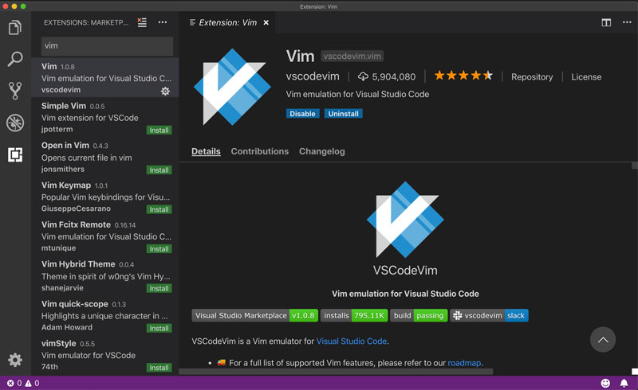

# Instalar VIM dentro del código de Visual Studio

Para traer la genialidad de Vim dentro de Visual Studio Code, necesitarás instalar el [complemento VsCodeVim](https://github.com/VSCodeVim/Vim) :

1. Abre el código de Visual Studio
2. Ve a *extensiones*
3. Escribe `vim` en el cuadro de búsqueda
4. El primer complemento llamado **Vim** es el que se desea (*VSCodeVim*)
5. Haz clic en el botón de instalación.
6. ¡Victoria épica!

Así es como se instala VSCodeVim

Después de que Visual Studio Code termine de instalar la extensión, es posible que debas reiniciarla para que los cambios surtan efecto.

¿Lo has reiniciado?

¡Excelente! Abre un archivo de código de tu último proyecto y mira el cursor. ¿Se parece a un rectángulo? ¿Si?

Entonces, **¡Bienvenido a Vim!**

## ¿Estás utilizando la paleta de comandos de VSCODE?

Si no lo estás haciendo, definitivamente deberías. Escribe `CTRL-SHIFT-P` en Linux y Windows o `CMD-SHIFT-P` en una Mac y accederás a la paleta de comandos. Desde aquí puedes acceder a casi cualquier funcionalidad dentro de Visual Studio Code con solo escribir.

Por ejemplo, escribe *extensiones* y selecciona *Mostrar extensiones* para ir a la pestaña de extensiones. Impresionante ¿verdad? Escribe y mira si puedes encontrar cosas que normalmente usas en tu flujo de trabajo diario.

**Dominar los métodos abreviados como `CTRL-SHIFT-P`, para abrir la paleta de comandos, o `CTRL-P`, para ir a un archivo, es esencial para desarrollar un flujo de trabajo centrado en el teclado y mejorar tu productividad en Visual Studio Code. Así que apréndelos y úsalos.** Me lo agradecerás más tarde.

> Las nuevas versiones de Visual Studio Code traen soporte para complementos que funcionan desde el primer momento tan pronto como se instalan. Pero nunca se sabe... Siempre se siente más seguro reiniciar