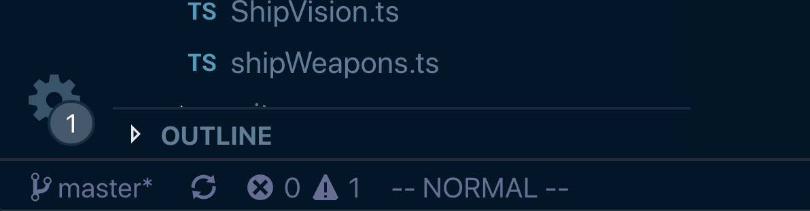
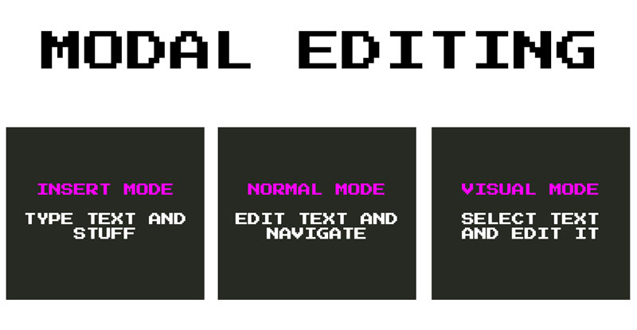
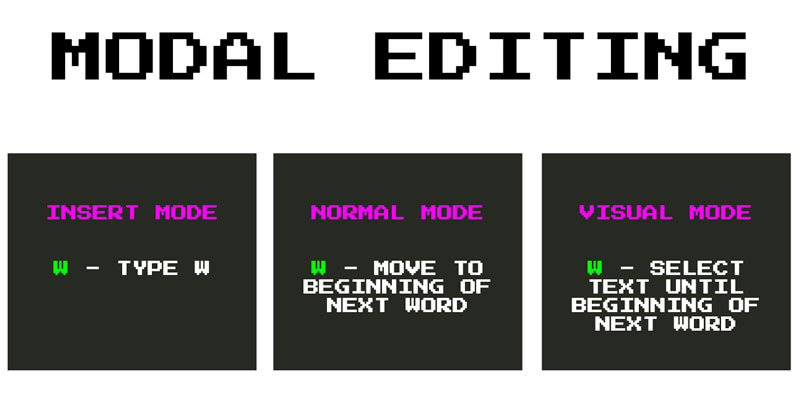
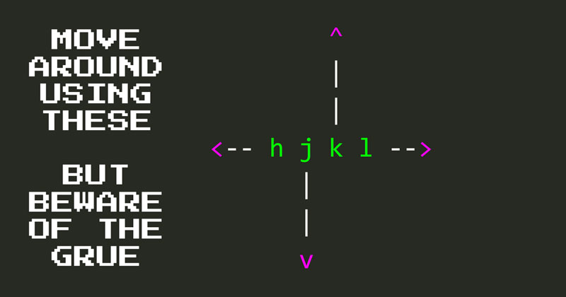
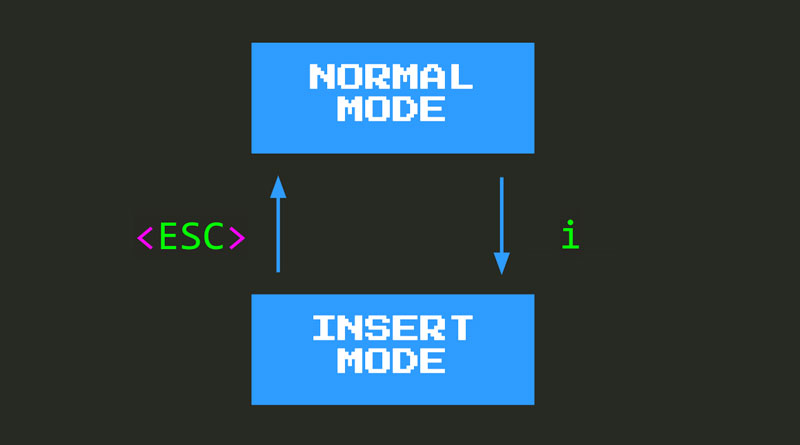
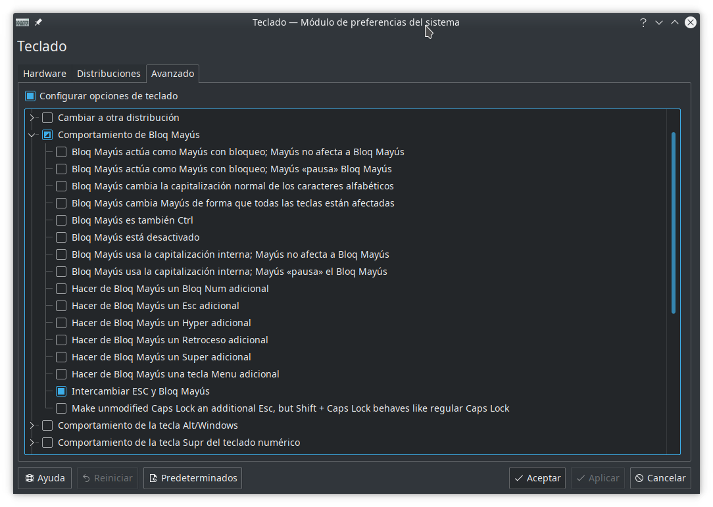
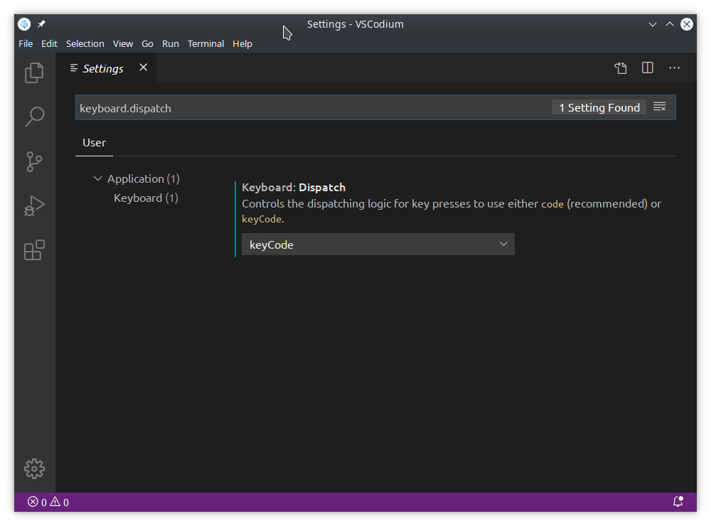

# Primeros pasos en VIM

Un cursor en forma de rectángulo... ¡Curioso! Si intentas escribir texto en este momento, te sorprenderás al ver que no sucede nada; ó, para ser más precisos, no pasa nada de lo que esperabas. Por un lado, a medida que escribes en el teclado, no se reflejan caracteres en la pantalla. De hecho, es probable que al escribir, te topes con un comando de significado especial que enviará tu cursor volando por la pantalla o incluso eliminará o editará algún código.

Todo este comportamiento extraño e inesperado es el resultado del **modo Normal**, el modo predeterminado en el que interactúas con el código en VIM. Y, en *modo Normal*, uno no inserta texto.

Entonces, ¿qué es el **modo normal**? Y, además, **¿qué significa el modo**?.

*¿Ves el mensaje --NORMAL-- en tu barra de estado? Eso es VSCodeVIM que te dice que estás en modo Normal.*

## Modos en VIM

Los modos son una de las decisiones de diseño más importantes e impactantes en VIM, por lo que vale la pena pasar un poco de tiempo para comprender realmente qué significan los modos y cómo afectan en la experiencia del desarrollador de VIM.

Los modos VIM siguen el mismo principio de **usa el sombrero adecuado** para la situación correcta. Dependiendo de la tarea en cuestión, puedes (figurativamente) *usar el sombrero adecuado* para adaptar mejor tu forma de pensar, comportamiento y mentalidad a esa situación. Por ejemplo, si estás tratando de resolver un problema de formas novedosas, es posible que desees usar una gorra de explorador que muestre tu mentalidad exploratoria. Si quieres ser valiente y atrevido en una situación incómoda, usarás el casco de un vikingo. ¿Diplomático? Un sombrero de cortesano, etc.

De manera similar, el editor de VIM tiene diferentes modos que se adaptan mejor a la realización de diferentes tareas. Por ejemplo, estos son tres de los modos más comunes en VIM:

Al igual que usar el sombrero adecuado, cuando uses VIM usará el *modo Insertar* cuando su objetivo sea **insertar texto**. Utilizará el *modo Normal* cuando su objetivo sea **editar texto** o navegar a través de su base de código, y utilizará el *modo Visual* cuando desee **seleccionar algún texto**.

Pero, ¿qué significan exactamente los modos? ¿Qué significa adaptarse a la tarea en cuestión en el contexto de un editor de texto?

En esencia, significa que tu teclado adquiere diferentes capacidades según el modo en el que se encuentre. Es decir, según el modo en el que se encuentre, al escribir una tecla en tu teclado obtendrás diferentes resultados adaptados a ese modo en particular. Toma la letra `w`, por ejemplo. Escribe `w` en cualquiera de estos modos y esto es lo que sucederá:

- En el *modo Insertar* , **escribirá** la letra `w`, como en cualquier otro editor.
- En el *modo Normal* , **moverá** el cursor al comienzo de la siguiente palabra.
- En el *modo Visual* , **seleccionará el** texto hasta e incluyendo el comienzo de la siguiente palabra.

Entonces, ¿qué ganamos con que VIM sea un editor modal?

Gracias a la existencia de modos, el teclado se convierte en una pizarra en blanco en cada uno de ellos. Lo que significa que VIM es libre de adaptar completamente el teclado para que sea el más efectivo para realizar la tarea en cuestión, teniendo la funcionalidad deseada al alcance de la mano. Como resultado, y a diferencia de otros editores no modales, VIM no necesita confiar en combinaciones de teclas locas (`CTRL+ALT+SHIT+something`). Eso significa que serás más rápido, serás más efectivo y mantendrás la salud de tus muñecas y dedos mucho más tiempo.

Si. Estás en **modo Normal**. En este modo no inserta texto. En cambio, te mueves y lo editas. Esta decisión de diseño surge de la constatación de que **pasamos mucho más tiempo leyendo, navegando y cambiando el código de lo que lo hacemos insertándolo en primer lugar**.

## Modo normal

Así que, el **modo Normal** es el modo predeterminado en VIM (a diferencia del *modo Insertar* , que es el modo predeterminado y único en la mayoría de los otros editores). En *modo Normal* no se inserta texto. En cambio, te mueves y lo editas. Esta decisión de diseño surge de la constatación de que **pasamos mucho más tiempo leyendo, navegando y cambiando el código que insertándolo inicialmente**.

**El modo normal** puede sentirse como un lugar hostil al principio, ya que escribir cualquier tecla puede y dará como resultado un comportamiento inesperado. Por lo tanto, ayuda entrar en *modo Normal* con un poco de preparación. Estos son los conceptos básicos que necesitas para sobrevivir y comenzar a desarrollar tus habilidades de VIM:

- **Muévete** con las teclas `hjkl`.
- **Entra en el modo de inserción**, con `i`, el que permite escribir cosas como de costumbre.
- **Regresa al modo Normal** con `<ESC>`, `<CTRL>-C` o `<CTRL>-[`.

## Movimiento básico en VIM

**`hjkl` son los movimientos centrales y más básicos en VIM**. Te permite mover el cursor un caracter en cada dirección:

No es la forma más efectiva ni la más eficiente de moverse en VIM, pero sí te **brindan agilidad y confianza** para moverte por un archivo en *modo Normal*. Aprender `hjkl` de manera efectiva es el equivalente a aprender a caminar, o aprender a andar en bicicleta.

Después de que te sientas cómodo con más movimientos de VIM, no usarás `hjkl` tanto, pero serán **muy útiles para movimientos de corta distancia y pequeñas correcciones**. `j` y `k` también son muy útiles dentro del explorador de archivos, la paleta de comandos y los paneles *Ir a* ya que te permiten moverte hacia arriba y hacia abajo y seleccionar diferentes elementos.

## Del modo normal al modo de inserción y viceversa

La tecla `i` te permite ingresar al *modo Insertar* después del cursor. **Al comienzo de tu viaje a VIM, puedes ver `i` como una escotilla de escape hacia la cordura**. Si alguna vez te sientes estresado y no estás progresando, puedes `i`ngresar al *modo Insertar*, el mundo donde tu editor se comporta como lo hizo antes de instalar VIM.

Cuando te sientas con energía y entusiasmo, puedes escribir `<ESC>`, `<CTRL>-C` o `<CTRL>-[` y se te devolverá al *modo normal* en el que podrás editar y navegar por tu código. A medida que ganes confianza y aprendas más comandos, descubrirás que pasarás más y más tiempo en el *modo Normal*, y solo en el *modo Insertar* para ataques de edición de texto tácticos y precisos.

 `<ESC>` o `<CTRL>-[` pueden ser incómodos de escribir, por lo que tiendo a recomendar que se use `<CTRL>-C`. Y dado que usarás la tecla `CTRL` con bastante frecuencia (aunque no tan a menudo como con otros editores), te recomiendo que sigas este consejo:

## Intercambiar la tecla de bloqueo de mayúsculas con ESC

Algo muy útil cuando se usa VIM es reasignar la *tecla de bloqueo de mayúsculas* a *escape*. Hacer esto significa que ahora puedes alcanzar fácilmente una tecla muy utilizada en programación, como *Esc*, desde la comodidad de la fila de inicio del teclado. Solo necesitas estirar ese dedo meñique hacia la izquierda medio centímetro y ya está. El bloqueo de mayúscula puede reasignarse a la tecla *Esc* igualmente, con lo que tampoco se pierde esta funcionalidad y se evita tener teclas duplicadas para la misma función.

El proceso es específico para cada sistema y habría que investigar *cómo hacerlo* en cada uno de ellos. Como ejemplo veamos el caso del conocido escritorio **Plasma de KDE**.

- Accedemos a la configuración de nuestro teclado y seleccionamos la pestaña *Avanzada*.
- Desplegamos *Comportamiento de Bloq Mayús* y seleccionamos el que más nos interese; en este caso **Intercambiar Esc y Bloq Mayús** si bien se podría haber elegido **Hacer de Bloq Mayús un Esc adicional** ó **Make unmodified Caps Lock an additional Esc, but Shift + Caps Lock behaves like regular Caps Lock**.

Hay quien prefiere utilizar `Caps Lock` como una  alternativa más accesible para la tecla `Ctrl` dado que **Vim** usa la combinación `<Ctrl>-C` como altenativa a `Esc` como ya hemos señalado.

Si bien podríamos pensar que ya está todo listo, no es el caso. De hecho podemos comprobar que nuestro cambio se ha hecho efectivo para todo el sistema y funciona allá donde lo probemos; por ejemplo en una versión clásica de **Vim**. Pero no así en **Visual Studio Code** que presenta la característica de usar su propio *dispatcher* de teclas. Hemos de cambiar este comportamiento para que use el del propio sistema accediendo a *Settings* y cambiando la propiedad [*keyboard.dispatch*](http://github.com/microsoft/vscode/wiki/Keybinding-issues) estableciéndola en *keyCode* como se muestra en la imagen siguiente:

## Una nota importante para usuarios de windows y Linux

Espera... ¿`<CTRL>-C` para volver al **modo Normal**? ¿No es eso lo que he estado usando toda la vida para copiar cosas?

Instalar VSCodeVIM tiene un par de efectos secundarios. Una es que obtienes ese extraño cursor cuadrado que acabamos de comentar, y la otra es que algunas teclas de uso común se reasignan a su función natural en la tierra de VIM. Por ejemplo:

-  `<CTRL>-C` ya no copia, en su lugar te devuelve al *modo Normal*. El comando que usamos en VIM para copiar es mucho menos detallado: **`y`** (por *yank*, tirar).
- `<CTRL>-V` ya no pega y en su lugar te envía al *modo de bloque visual* . Nuevamente, el comando que usamos en VIM para pegar es menos detallado: solo una **`p`** (para `paste` pegar).
- `<CTRL>-F` ya no te permite buscar, en su lugar te permite desplazar tu pantalla una página hacia adelante. Una vez más, el comando que usamos en VIM para la búsqueda está más cerca de tu alcance: `/{término-a-buscar}`.

Dependiendo de lo aventurero que seas y tu tolerancia a las molestias, es posible que desees mantener sus teclas como están ahora en lugar de continuar con los cambios realizados por VIM. Si sientes que deseas deshabilitar estas reasignaciones por el momento, puedes usar estas dos configuraciones de VSCodeVIM:

- `VIM.useCtrlKeys` habilita y deshabilita la reasignación de las teclas `CTRL`. Configúralo en `false` y las teclas para copiar, pegar, buscar, etc. volverán de nuevo a los valores por defecto de VSCode. Ajústalo a `true` y VIM se hará cargo.
- `VIM.handleKeys` te brinda un control más granular sobre las asignaciones que puedes habilitar o deshabilitar. Es un diccionario de pares clave/valor, donde la clave es la combinación de teclas que se desea habilitar/deshabilitar y el valor es un indicador booleano que representa si VIM está habilitado para esa combinación de teclas o no. Por ejemplo, usar `"<C-d>": true` significa que `<C-d>` es manejado por VIM, mientras que al configurarlo `false` vuelve a la funcionalidad nativa de VSCode.

Las listas completas de las claves afectadas por estas reasignaciones se pueden encontrar en el archivo [package.json](https://github.com/VSCodeVIM/VIM/blob/master/package.json) de la [extensión VSCodeVIM](https://github.com/VSCodeVIM) en la sección de `keybindings`.

## RESUMEN

Cuando instales VSCodeVIM, tu editor de VSCode se convertirá en un lugar un poco extraño. VIM confía en los modos para hacerlo más efectivo y el modo predeterminado en VIM es el **modo Normal**, un modo en el que no se escribe texto en la pantalla.

**El modo normal** está optimizado para editar texto y navegar por su base de código. A menudo pasamos más tiempo editando y explorando código de lo que lo hacemos al insertarlo desde cero, por lo que es una decisión de diseño ingeniosa. Aún así, puede parecer bastante desalentador al principio, por lo que es útil conocer algunas de las claves que puedes usar para obtener un nivel básico de autonomía:

- Usa **`hjkl`** para moverte.
- Usa **`i`** para volver al *modo Insertar* donde puedes actuar como si estuvieras en VSCode vainilla y escribir.
- Usa  `<ESC>`, `<CTRL>-C` o `<CTRL>-[` para volver al *modo Normal* .

Con una mejor comprensión de la filosofía de VIM y estas asignaciones de teclas básicas en tu haber, ahora estás listo para continuar desarrollando tus habilidades de VIM y más cerca de ser más increíble en la programación. ¡Adelante!.
