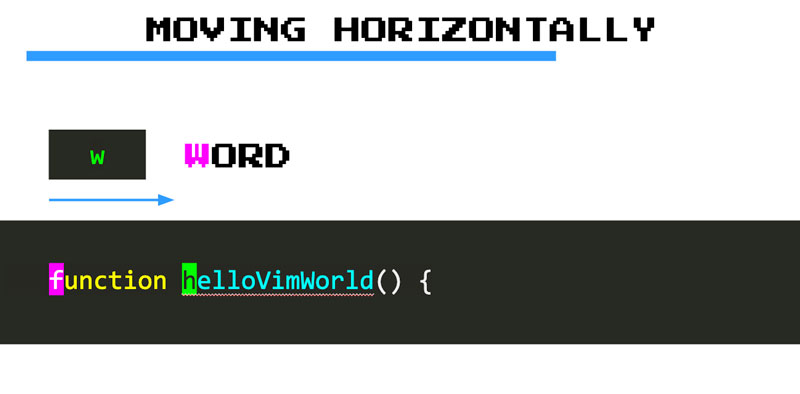
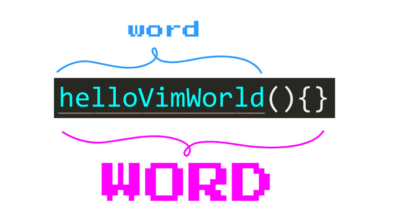

# Moviéndote increíblemente rápido con los movimientos CORE VIM

**Con movimiento hablamos de cómo te desplazas a través del texto en VIM**. Son comandos que, cuando se escriben, mueven el cursor con gran velocidad y precisión. Hay muchos de ellos, y cada uno es más adecuado para diferentes tipos y longitudes de movimiento. Funcionan muy bien en conjunto con las funciones nativas *Ir a* de Visual Code Code como *Ir a archivo* e *Ir a símbolo*.

Aquí encontrarás una lista condensada de los más útiles, y cuándo y cómo usarlos.

## Moverte horizontalmente palabra por palabra

**Los movimientos de palabras** te permiten saltar de una palabra a otra en cualquier dirección (de izquierda a derecha o de derecha a izquierda). Como tal, te permiten moverte más rápido que los movimientos horizontales básicos **`h`** y **`l`**.

Puedes utilizar **`w`** (comando **w**ord) para saltar al comienzo de la siguiente palabra de este modo:



Del mismo modo, puedes:

- Usar **`b`** (**b**ack) para saltar al principio de una palabra hacia atrás.
- Usar **`e`** (**e**nd) para saltar al final de una palabra.
- Usar **`ge`** (**g**o **e**nd) para saltar al final de una palabra hacia atrás.

## Aprende los comandos con la ayuda de mnemónicos

VIM tiene una enorme cantidad de comandos. Con el tiempo, cuando se convierta en un usuario experimentado de VIM, los comandos se convertirán en algo natural, reflexivo y automático. Sin embargo, al principio, tendrás que aprenderlos uno por uno.

Una excelente manera de aprender los comandos de VIM es mediante el uso de mnemónicos como asociar una letra a una palabra que sea más fácil de recordar. Por ejemplo, puedes recordar que `w` permite moverse de una palabra a otra al asociarlo con una **word**, o que **b** permite mover una palabra hacia atrás al asociarlo con **back**.

Siguiendo esta técnica, descubrirás que puedes aprender y recordar muchos comandos con poco esfuerzo.

## PALABRAS y palabras

Por lo tanto **`w`**, **`b`**, **`e`** y **`ge`** te permiten moverte palabra por palabra en VIM. Pero, ¿qué es exactamente una palabra? Una palabra en VIM es:

1. Una secuencia de letras, dígitos y números.
2. Una secuencia de otros caracteres no en blanco.

```text
these are 4 words
and these below too
,,, ..... ((((( ,.(
```

Pero VIM también tiene el concepto de tipos especiales de palabras (con letras, cifras y números) que también incluyen caracteres especiales como **`.`**, **`(`**, **`{`**, etc. Se llaman PALABRAS en la jerga de VIM:



Las PALABRAS son particularmente útiles para nosotros los programadores porque el código a menudo tiene muchas de ellas:

```text
this is a WORD: Iam_A_WORD(WORD)
this function call sum(2,3) is also a WORD
this array [1,2,3,4,5] is a WORD as well
```

Si deseas moverte PALABRA por PALABRA puedes utilizar los equivalentes en mayúsculas de los movimientos descritos anteriormente (**`W`**, **`B`**, **`E`**, **`gE`**).

En general, los **movimientos de palabras permiten cambios más precisos, mientras que los movimientos de PALABRAS permiten movimientos más rápidos**:

```text
wwww ==> v   v v   v   v
         word. are two words
         word. is one WORD
WWW  ==> ^     ^  ^   ^
```

## Moverse a un carácter específico

**El movimiento a caracteres con "find"** te permite moverte con una **alta precisión** de forma horizontal y rápidamente:

- Usa **`f{character}`** (**f**ind) para pasar a la siguiente aparición de un carácter en una línea. Por ejemplo, **`f"`** te envía a la próxima aparición de una comilla doble.
- Si tu objetivo está antes del cursor, puedes usar **`F{character}`** para encontrar la aparición previa de un carácter. 


Podemos ver claramente cómo **`f`** es más rápido y preciso que usar movimientos de palabras lanzando uno contra el otro en un ejemplo:

```text
f(   ==> v                        v
         const fireball = function(target){
wwww ==> ^     ^        ^ ^       ^
```

Además de **`f`** VIM también ofrece el comando **`t`** (un**t**il):

- Utiliza **`t{character}`** para mover el cursor justo antes de la próxima aparición de un caracter (pensar en `t{character}` como forma de mover el cursor hasta (un**t**il) ese carácter).
- De nuevo, se puede usar **`T{character}`** para hacer lo mismo `t{character}` pero hacia atrás.

Si la diferencia entre los comandos **`f`** y **`t`** aún no está del todo clara, aquí hay un ejemplo que compara a ambos:

```text
t(   ==> v                       v
         const fireball = function(target){
f(   ==> ^                        ^
```

**`t`** es realmente útil cuando combina movimientos con operadores para realizar cambios de texto como pronto descubrirás (por ejemplo, se podría eliminar todo hasta `(` y cambiarlo por otra cosa).

Después de usar **`f{character}`**, puedes escribir **`;`** para ir a la siguiente aparición del carácter o **`,`** para ir a la anterior. **Se pueden ver los comandos `;` y `,` como para repetir la última búsqueda de caracteres**. Esto es bueno porque te evita escribir la misma búsqueda una y otra vez:

```text
fdfdfd ==> v   v               v        v
           let damage = weapon.damage * d20();
           let damage = weapon.damage * d20();
fd;;   ==> v   v               v        v
```

> **Notas, melodías y acordes**
>
>VIM es bastante especial. Si has utilizado otros editores, probablemente estés acostumbrado a escribir acordes de teclas. Es decir, escribir una combinación de teclas al mismo tiempo. Por ejemplo, `CTRL-C` copiar y `CTRL-V` pegar. Aunque VIM no es ajeno a los acordes, se basa aún más en las melodías de las teclas.
>
>**Una melodía** es una serie de notas que se tocan una tras otra. Si piensas en las teclas como notas, entonces las melodías de teclas son teclas que se presionan una tras otra en rápida sucesión. Entonces, cuando lees que necesitas escribir `f{character}`para encontrar un carácter en una línea, significa que primero escribes `f` y luego escribes el carácter `{character}`. Estas dos teclas, por lo tanto, se tocan como una melodía.
>
>Usar melodías de teclas es la forma más común con la que interactúas con VIM. Y, aunque no es familiar ni extraño, es muy conveniente porque controlar el editor de repente parece que solo consiste en escribir texto. También es maravilloso para la salud de tus muñecas porque ya no necesitas confiar en combinaciones de teclas complejas y antinaturales que tensan tus pobres articulaciones.

## Moverte horizontalmente a los extremos

Para **moverte horizontalmente a los extremos,** usa:

- **`0`**: Se mueve al **primer carácter de una línea**
- **`^`**: Se mueve al **primer carácter no en blanco de una línea**
- **`$`**: Se mueve al **final de una línea**
- **`g_`**: Se mueve al último carácter **no en blanco al final de una línea**

## Moviéndote verticalmente

A partir de **`k`** y **`j`,** pasamos a una **forma más rápida de maniobrar verticalmente** con:

- **`}`** salta párrafos enteros **hacia abajo**
- **`{`** de manera similar pero **hacia arriba**
- **`CTRL-d`** te permite **bajar media página** desplazándose por la página
- **`CTRL-u`** te permite **subir media página** también desplazándote

Ninguno de estos están dentro de mis favoritos, pero por el momento lo estarán. En el capítulo de asignaciones personalizadas se aprenderá cómo crear una combinación de teclas personalizada para un mejor movimiento vertical de rango medio.

## Movimientos verticales de alta precisión con patrón de búsqueda

Para **moverse verticalmente aún más rápido** cuando tiene un objetivo en mente, tu mejor opción es **buscar** ese objetivo con los comandos **`/{pattern}`** y **`?{pattern}`**:

- Usa **`/{pattern}`** para **buscar hacia adelante**
- Usa **`?{pattern}`** para **buscar hacia atrás**

Donde el fragmento `{pattern}` a menudo será una cadena literal (el nombre de un método, clase o variable) pero también puede ser una expresión regular.

Si estás cerca de tu computadora, intenta escribir un comando de búsqueda ahora mismo. Descubrirás que, a medida que escribes un comando de búsqueda, se resalta cualquier fragmento de texto dentro de un archivo que coincida con tu patrón. A medida que continúes escribiendo el patrón, las áreas resaltadas se actualizarán y reflejarán las nuevas coincidencias. Cuando encuentres lo que estás buscando, escribe **< Enter >** y tu cursor saltará a la primera coincidencia en el documento. Allí puedes realizar alguna edición si quieres y luego usar **`n`** para saltar a la siguiente ocurrencia (o **`N`** a la anterior). **Puedes pensar en `n` como en repetir una búsqueda**.

> **Habilitar la búsqueda resaltada**
>
>La búsqueda resaltada no está habilitada de forma predeterminada en VSCodeVIM. Para remediar eso, ve a *Preferencias > Configuración* y activa la opción *VIM: Hlsearch* (o, alternativamente, usa `vim.hlsearch` en la versión json de la configuración).

A VIM le encanta ahorrar tiempo: escriba **`/`** o **`?`** en cualquier momento para ejecutar la última búsqueda (hacia adelante o hacia atrás). O usa **`*`** para buscar la palabra debajo del cursor (**`#`** para hacer lo mismo pero hacia atrás).

## Moverse más rápido con cuentas

**Las cuentas son números que te permiten multiplicar el efecto de un comando**. Puedes usarlos como prefijo de cualquier comando con un conteo como este:

```text
{count}{command}
```

Por ejemplo:

- **`2w`** nos permite mover el cursor 2 palabras hacia adelante.
- **`5j`** cambia la posición del cursor a 5 líneas a continuación.
- **`3;`** te permite pasar a la siguiente tercera aparición de un carácter (tras un **`f`** ó **`t`** previo)
- **`2/baby`** te envía volando a la segunda aparición de `baby`.

En general, se usa **`{count}{motion}`** para multiplicar **`{count}`** veces el movimiento.

## Números de línea relativos

Una excelente manera de moverse verticalmente dentro de VIM es mediante el uso de conteos en combinación con los movimientos `j` y `k`. Pero a veces puede ser difícil saber cuántas líneas necesitas saltar para llegar a la posición deseada. Ahí es donde los **números de línea relativos** pueden ser bastante útiles.

Los números de línea relativos muestran los números de línea en relación con tu línea actual: si la línea actual es donde descansa el cursor, la línea de abajo tendría la línea número 1, la siguiente línea número 2, y así sucesivamente. Usando números de línea relativos, es muy sencillo ver cuántas líneas necesitas saltar para llegar a donde quieres ir. Solo echa un vistazo al número de línea relativo y úsalo como un recuento.

> Puedes habilitar los números de línea relativos en tu configuración de VSCode yendo a *Preferencias > Configuración*, buscando la configuración de *line numbers* y configurándola como **relative**.

## Moviéndote semánticamente

Además de los movimientos anteriores, que realmente no tienen en cuenta el significado del código, VIM ofrece enlaces adicionales que tienen en cuenta su semántica:

- Usa **`gd`** para saltar a la definición de lo que esté debajo del cursor.
- Usa **`gf`** para saltar a un archivo en una importación.

## Algunos movimientos más ingeniosos

Estos son más movimientos que pueden ser útiles de vez en cuando:

- Escribe **`gg`** para ir al principio del archivo.
- Usa **`{line}gg`** para ir a una línea específica.
- Usa **`G`** para ir al final del archivo.
- Escribe **`%`** para saltar entre los pares de apertura y cierre de los símbolos **`({[]})`**.

## Resumen

**Los movimientos son comandos que te permiten moverte en VIM con alta velocidad y precisión**. Están compuestos por una o más teclas escritas como **melodías**. Te permiten realizar diferentes tipos de movimientos con diferentes longitudes y grados de precisión.

Los más básicos **`hjkl`** son excelentes para pequeñas correcciones. Luego tenemos **movimientos de palabras y párrafos** (**`w`**, **`{`**) que son buenos para navegar por el código más rápido. Después de eso, tenemos **movimientos de búsqueda de alta precisión** (**`f`**, **`/`**) que nos permiten teletransportarnos rápidamente a un carácter o patrón de búsqueda.

Los movimientos de búsqueda de caracteres y búsqueda tienen **repetidores** (**`n`**, **`;`**) que nos permiten repetir la última búsqueda escribiendo solo un carácter. Podemos usarlos para saltar de una coincidencia a otra en cualquier dirección y muy rápidamente. El concepto de repetidores es un tema común en VIM y aprenderás muchos de ellos en adelante. **Entrénate para confiar en los repetidores, y serás más efectivo**.

**Puedes combinar conteos con movimientos para un mayor efecto**. Nuestros cerebros son lentos para contar, por lo que debes **limitar el uso de conteos solo a saltos cortos**. Al usar conteos con movimientos verticales, es bueno habilitar **números relativos** porque te dan una referencia clara a tu objetivo. **Considera habilitar números relativos si aún no lo has hecho**.

Ahora pasemos a otro bloque fundamental en VIM que te permitirá editar texto como por arte de magia: **Operadores**.
