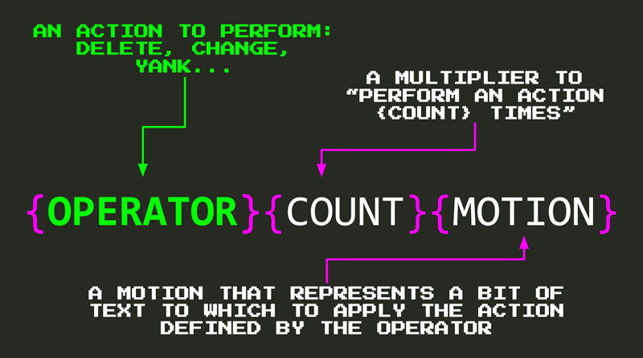
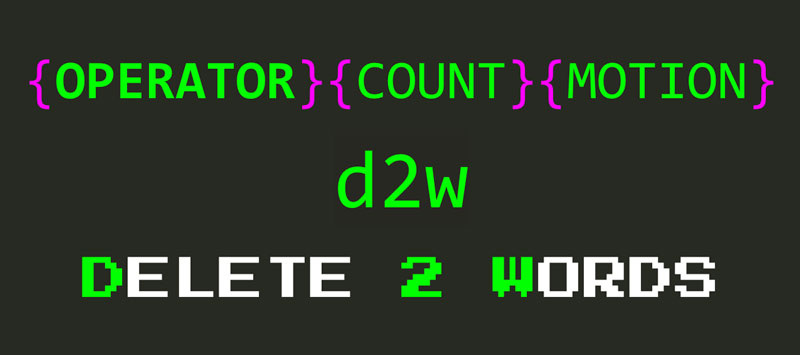
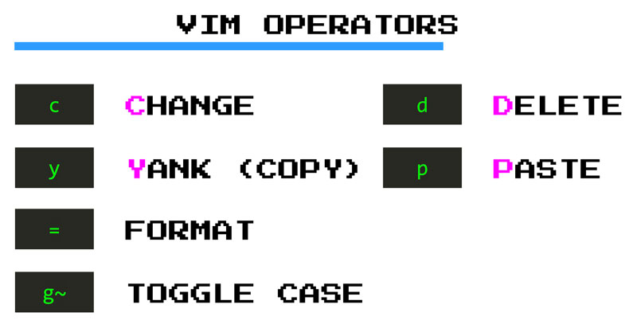
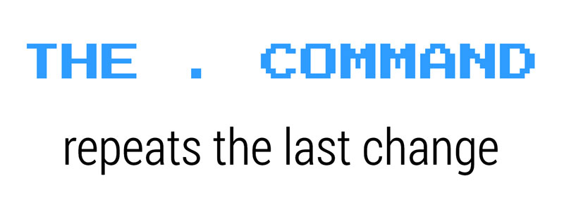

# Edición mágica con operadores de VIM

El movimiento no es solo para moverse. Se puede usar en combinación con una serie de comandos llamados **operadores** para editar tu código a la velocidad del rayo.

Puedes usar operadores y movimientos juntos siguiendo cualquiera de estos patrones:

```text
{operador}{cuenta}{movimiento}
{cuenta}{operador}{movimiento}
```



- El **operador** determina qué acción se desea realizar: eliminar, cambiar, tirar (*yank*), formatear, etc.
- La **cuenta** te permite multiplicar el efecto de un operador mediante la realización de una acción *cuenta* número de veces.
- El **movimiento** representa el fragmento de texto al que aplicar la acción definida por el operador.

Por ejemplo, la combinación `d2w` te permite **eliminar dos palabras**.



**`d`** corresponde al operador de **eliminación**. Como **`d`** es un operador, puede seguir la fórmula `{operator}{count}{motion}` y combinarla con todos los movimientos que has aprendido hasta ahora:

- Usa **`d5j`** para eliminar 5 líneas hacia abajo
- Escribe **`df'`** para eliminar todo en la línea actual del cursor hasta la primera aparición del carácter **`'`** (incluido el propio carácter)
- O escribe **`dt'`** para hacer como el ejemplo anterior pero excluyendo el carácter (hasta o justo antes del carácter **`'`**)
- Usa **`d/hello`** para eliminar todo hasta la primera aparición de **`hello`**
- Escribe **`ggdG`** para borrar un documento completo

## Operadores útiles



Además de **`d`**, hay un puñado más de operadores útiles:

- **`c`** (**c**hange): *Change* elimina un trozo de texto y luego establece el *modo de inserción* para que se pueda seguir escribiendo, cambiando el texto original por otra cosa. El operador de cambio es como los comandos **`d`** e **`i`** combinados en uno. Esta dualidad lo convierte en un operador más útil.
- **`y`** (**y**ank): copiar en la jerga de VIM
- **`p`** (**p**ut/**puaste): pegar en la jerga de VIM
- **`g~`** (mayúscula): cambia las letras de minúsculas a mayúsculas y viceversa. Alternativamente, usa **`gu`** para convertir algo en minúsculas y **`gU`** para convertir algo en mayúsculas
- **`>`** (desplazamiento a la derecha): agrega sangría
- **`<`** (desplazamiento a la izquierda): elimina la sangría
- **`=`** (código de formato): código de formatos

Puedes usar estos operadores de la misma manera que usaste **delete** para:

- **`c/hello`** cambia todo hasta la primera aparición de `hello`.
- **`ggyG`** copia un documento completo
- **`gUw`** capitaliza una palabra

## Sintaxis abreviada de operador

Todos estos operadores proporcionan una sintaxis abreviada adicional destinada a ahorrarte mecanografía y aumentar tu velocidad con tareas de edición comunes:

- **Duplica un operador para que funcione en una línea completa**: **`dd`** elimina una línea completa, **`cc`** cambia una línea completa, etc.
- **Capitaliza un operador para que realice una versión más fuerte (o alternativa) de su comportamiento predeterminado** : **`D`** elimina del cursor al final de la línea, **`C`** cambia al final de una línea, **`Y`** como **`yy`** copia una línea completa, **`P`** pega algo antes del cursor, etc.

> ¿Notaste cómo las teclas de comando tienen mucho sentido?
>
>Los operadores, movimientos y otros comandos en VIM son generalmente fáciles de aprender porque tienen sentido y son fáciles de adivinar. ¿Quieres cambiar algo? Es posible que desees utilizar el *c* (operador **c**ambiar). ¿Quieres moverte palabra por palabra? Prueba *w*(**w**ord). ¿Quieres borrar algo? Prueba el operador *d* (**d**elete) y así sucesivamente.

Los operadores realmente brillan cuando los combinamos con una clase especial de movimientos llamados **objetos de texto**.

## Tomando la edición de una muesca con objetos de texto

Los objetos de texto son fragmentos de texto estructurados o, si lo deseas, las entidades de un modelo de dominio de documentos. ¿De qué está compuesto un documento? Palabras, oraciones, texto citado, párrafos, bloques, etiquetas (HTML), etc. **Estos son objetos de texto.**

La forma de especificar un objeto de texto dentro de un comando es combinando la letra **`a`** (**un** objeto de texto más espacios en blanco) o **`i`** (objeto **interno** sin espacios en blanco) con un carácter que representa un objeto de texto en sí:


```text
{operator}{a|i}{text-object}
```

Los objetos de texto incorporados son:


- **`w`** para **w**ord
- **`s`** para **s**entence
- **`'`**, **`"`**, **```** para las cotizaciones
- **`p`** para **p**aragraph
- **`b`** (o **`(`**, **`)`**) para el bloque rodeado por **`()`,**
- **`B`** (o **`{`**, **`}`**) para el bloque rodeado por **`{}`**
- **`<`**, **`>`** por un bloque rodeado de**`<>`**
- **`[`**, **`]`** por un bloque rodeado de**`[]`**
- **`t`** para etiqueta.

Entonces, para eliminar diferentes fragmentos de texto, puedes usar cualquiera de los siguientes comandos:

- **`daw`** a **d**elete **un** **w**ord (más espacios en blanco finales)
- **`ciw`** a **c**hange **i**nner **w**ord
- **`das`** a **d**elete **un** **s**entence (**`dis`** para eliminar frase interno)
- **`da"`** a algo de eliminación entre comillas dobles incluyendo las cotizaciones a sí mismos (**`di"`** elimina sólo el contenido **i**Nside las cotizaciones de repuestos y las comillas)
- **`ci"`** cambiar algo entre comillas dobles
- **`dap`** para eliminar un párrafo
- **`dab`** **`da(`** o **`da)`** para eliminar un bloque rodeado de **`(`**
- **`daB`** **`da{`** o **`da}`** para eliminar un bloque rodeado de **`{`**
- **`dat`** eliminar una etiqueta HTML
- **`cit`** para cambiar el contenido de una etiqueta HTML

**Combinar objetos de texto con operadores es extremadamente poderoso** y se encontrará confiando en ellos con mucha frecuencia. Cosas como `cit`, `ci"`y `cib` son simplemente geniales.

Digamos que queremos cambiar el contenido de esta cadena a continuación por otra cosa:

```javascript
const salute = 'I salute you oh Mighty Warrior'
```

Escribes `ci'Hi!` y se convierte en:

```javascript
const salute = 'Hi!'
```

Así. No necesitas agarrar el ratón, seleccionar el texto y luego escribir otra cosa. Escribe tres letras y ¡Boom! Ya terminaste.

>¿Notaste cómo se colocan la mayoría de las teclas vim cerca de tus dedos?
>
>El hecho de que VIM tenga modos permite reutilizar las teclas cerca de la fila de inicio en cada modo separado. Esta decisión de diseño minimiza la necesidad de combinaciones de teclas lentas y retorcidas, y aumenta su velocidad y la longevidad de sus dedos y muñecas. **¡Esto es asombroso!**

## Repetir el último cambio con el operador punto

VIM tiene otro truco en la trastienda para ti destinado a guardar más pulsaciones de teclas: el comando mágico **`.`** (punto).



**El comando `.` te permite repetir el último cambio que realizaste**. Imagina que ejecutas **`dd`** para eliminar una línea de código. Y ahora digamos que te has calentado y quieres eliminar aún más código. Eliminar el código es bueno, cuanto menos código tengas, menos código necesitas mantener. Así que, eliminemos otra línea de código. ¿Cómo harías eso? Podrías volver a escribir **`dd`** pero, aún mejor, podrías usar el comando **`.`** que es solo una pulsación de tecla.

OK. Guarda una pulsación de tecla. Y qué. (Mucho público veo aquí). Bueno, puedes usar el comando **`.`** para repetir **cualquier tipo de cambio**, no solo un solo comando abreviado como `dd`. Por ejemplo, podría cambiar una palabra por `Awesome` así `cawAwesome`, y luego repetir todo el comando con todas esas pulsaciones de teclas simplemente escribiendo un solo punto. ¡Piensa en las posibilidades!

El **`.`** comando se vuelve aún más útil si tienes la costumbre de usar objetos de texto. Los objetos de texto son más confiables que otros movimientos porque no importa tanto dónde está ubicado el cursor. Por lo tanto, los comandos con objetos de texto son mucho más repetibles y, por lo tanto, funcionan maravillosamente en conjunto con el comando **`.`**.

El comando **`.`** funciona muy bien en combinación con los comandos de búsqueda de repetición ( **`;`**, **`,`**, **`n`** o **`N`**). Imagina que deseas eliminar todas las apariciones de `cucumber`. Un posible enfoque sería buscar el pepino `/cucumber`, eliminarlo con **`daw`** y, a partir de ese momento, usar **`n`** para ir a la siguiente y **`.`** para eliminarlo. ¡Dos pulsaciones de teclas! De nuevo piensa en las posibilidades.


## Más comandos de edición de texto abreviado

Además de los operadores que aprendiste en este capítulo, VIM ofrece una serie de atajos para operar con caracteres individuales que pueden ser útiles en ocasiones. Son:

- **`x`** es equivalente **`dl`** y elimina el carácter debajo del cursor
- **`X`** es equivalente **`dh`** y elimina el carácter antes del cursor
- **`s`** es equivalente a **`ch`**, elimina el carácter debajo del cursor y lo pone en *modo Insertar*
- **`~`** para cambiar a mayúsculas/minúsculas un carácter

Como de costumbre, todo el soporte anterior cuenta para operar en varios caracteres a la vez.

## Deshacer y rehacer

Tarde o temprano llegará un momento en que cometerás un error. ¡Admítelo! No eres perfecto. Nadie lo es. Y eso está bien. Sin embargo, no debes preocuparte, porque VIM te respalda:

- Escribe **`u`** y desharás tu último cambio,
- Escribe **`CTRL-R`** y lo reharás,

*Pheeewww ...*

## Resumen

**Los movimientos no son solo para moverse. Utilizados en combinación con operadores, te permiten realizar operaciones en texto con facilidad y una velocidad sorprendente** . Aplica un operador en un movimiento utilizando la melodía clave `{operator}{motion}`.

Algunos de los operadores más útiles y comunes son: **`d`** para **d**elete, **`c`** para **c**hange, **`y`** para **y**ank (copiar) y **`p`** para **p**ut (pegar). Como puedes apreciar de estos operadores y los movimientos que has aprendido hasta ahora, los comandos de VIM son generalmente fáciles de aprender porque tienen sentido y son fáciles de adivinar.

**Cuando se duplica un operador, se le hace operar sobre una línea** . Por ejemplo, puedes usar **`dd`** para eliminar una línea completa. De manera similar, **cuando se usa un comando en mayúsculas, se ejecuta una versión más fuerte (o alternativa) del comando original**. Por ejemplo, **`D`** elimina del cursor al final de una línea. Esto es realmente útil y pueden ahorrarte mucho tiempo. Aprende a usarlos en lugar de sus alternativas más verbales.

**Las cuentas también funcionan con operadores**. Se puede multiplicar el efecto de un movimiento combinado de operación, utilizando una cuenta de la siguiente manera: `{operator}{count}{motion}`.

**Los objetos de texto tienen movimientos especiales que describen las partes de un documento: palabras, oraciones, párrafos y demás**. Son increíblemente útiles en combinación con los operadores de VIM.

**Usando operadores con objetos de texto se puede ser muy preciso y ordenarle a VIM que elimine una palabra o cambie el interior de una cadena o bloque de código** .

Los objetos de texto ofrecen dos variantes: **`a`** (piensa en **a** como **a**ll) e **`i`** (piensa en **i**nner) que te permite operar en un objeto de texto más el espacio en blanco circundante o solo en las partes internas de un objeto de texto, respectivamente. Por ejemplo, el uso **`da"`** elimina una cita completa que incluye espacios en blanco al final, usando **`di"`** solo elimina lo que esté rodeado de comillas.

**El comando punto te `.` permite repetir el último cambio** y, como tal, es uno de los comandos repetidores más útiles. **Las operaciones en objetos de texto son excelentes candidatos para el operador de punto porque son más repetibles** .

**Una excelente manera de aprovechar el comando punto es usarlo en combinación con búsquedas** . Cuando lo hagas, puedes aplicar cambios de búsquedas sucesivas con solo dos pulsaciones de teclas: **`n`** o **`;`** para encontrar la siguiente coincidencia y **`.`** repetir el último cambio.

A veces cometerás un error. Cuando eso sucede, **puedes deshacer el último cambio con el comando `u`** . Si cambias de opinión o deshaces demasiado, escribe `CTRL-R` para **r**edo.