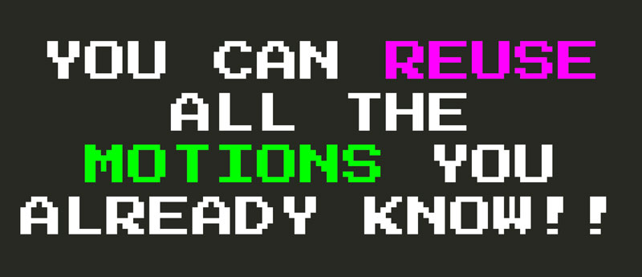

# El lenguaje secreto de vim

Como habrás notado, todos los operadores, conteos y movimientos de Vim que has aprendido forman una especie de lenguaje (de programación). Puedes pensar en los operadores como funciones, y cuentas y movimientos como argumentos, o usando una analogía aún más simple... **Puedes pensar en operadores como verbos, cuentas como adjetivos y movimientos como objetos**.

**[La verdadera magia de Vim es la composición](https://medium.com/@mkozlows/why-atom-cant-replace-vim-433852f4b4d1)**. A medida que vayas construyendo este vocabulario de operadores y movimientos, encontrarás que puedes combinarlos según marque tu corazón. Tal como lo harías con las palabras de un idioma hablado.

De manera que, una vez que sabes todo sobre el **`cl`**, **`caw`**, **`ciw`**, **`ct.`** del mundo, y que vayas a aprender cómo funciona **`dl`**, no sólo serás capaz de utilizar **`dl`**. No. Sabrás inmediatamente que también se puede combinar el operador **`d`** con todo el vocabulario de movimientos que ya tienes a tu disposición y **`daw`**, **`diw`**, **`dt.`** hasta el final de los tiempos.

**Esto es muy refrescante**.

Cuando uses Vim, sentirás que estás **navegando por un metauniverso de edición de texto**, es como programar o controlar el mismo mecanismo de edición y escritura de texto. Si estás familiarizado con `git` y cómo se siente usar la línea de comandos `git` para trabajar con el control del código fuente, puedes pensar en Vim como el `git` de la edición de texto. (Dejando de lado el hecho de que Vim es anterior a `git` en casi 30 años).

**Con Vim, te verás en un trozo de texto y ya no verá más que palabras o texto, verás las posibilidades de un número infinito de operadores y movimientos que se pueden aplicar a la vez.