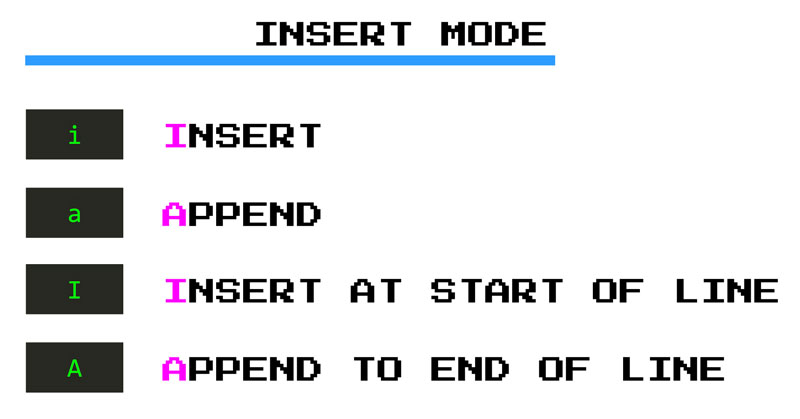
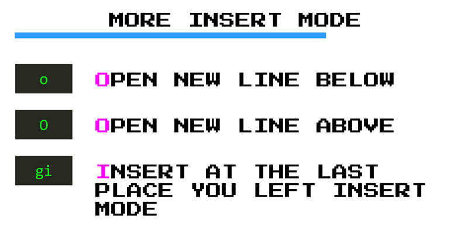

# Insertar texto a la vim

Antes de editar un programa, alguien tendrá que escribirlo y esa persona puede ser tú. En Vim, escribes código en el **modo Insertar**. Has visto un poco del modo Insertar cuando usas el comando **`c`**, pero vamos a sumergirnos en este modo un poco más.

Hay dos comandos principales que te ponen en *modo Insertar*:

- **`i`** por **i**nserto (insert)
- **`a`** por **a**nexo (append)

El comando **`i`** de inserción te pone en modo de inserción **antes** del cursor. Mientras que el comando de anexión **`a`** te pone en modo de inserción **después** del cursor. A partir de entonces, estarás en *modo Insertar* y Vim se comportará como cualquier otro editor (*¡ bienvenido de nuevo VSCode!* ).

Al igual que con muchos otros comandos de Vim **`i`** y **`a`** tienen contrapartida en mayúsculas que son versiones **más fuertes** de inserción y anexión:

- **`I`** te pone en *modo Insertar* al comienzo de la línea actual mientras,
- **`A`** te pone en *modo Insertar* al final.

Además de **`i`** y **`a`**, hay otros tres comandos **súper útiles** para colocarnos en modo Insertar:

1. **`o`** inserta una nueva línea **debajo** de la actual y lo coloca en el modo Insertar (mnemónico: **`o`ne** line below)
2. **`O`** inserta una nueva línea **sobre** la actual y también lo coloca en modo Insertar
3. **`gi`** te pone en modo Insertar en el último lugar donde se dejó el modo Insertar. Esto es genial si abandonas el modo Insertar por error (o no) y quieres volver a donde estabas y continuar escribiendo.

Ok. Entonces, digamos que ahora estás en *modo Insertar*, tecleas y cometes un error (¡ay!). Algo así como un error tipográfico. ¿Vuelves al modo normal, arreglas el error tipográfico y vuelves al modo de inserción? ¡Por favor no!

Algunas veces. A menudo, es más rápido eliminar las letras o palabras incorrectas y escribir de nuevo. Hay un par de combinaciones de teclas que le permiten hacerlo directamente desde el *modo Insertar*:

- **`CTRL-h`** te permite eliminar el **último carácter** que escribiste
- **`CTRL-w`** te permite eliminar la **última palabra** que escribiste
- **`CTRL-u`** te permite eliminar la **última línea** que escribiste

Eventualmente, querrás salir del *modo Insertar* y hacer otras cosas. Hay tres maneras de hacer esto: **`ESC`**, **`CTRL-[`** y **`CTRL-C`**. De todos éstos, el más fácil de escribir es **`CTRL-C`** comenzar usando ese. En capítulos posteriores, aprenderemos cómo puede crear un mapeo personalizado que hará que salir del *modo Insertar* sea muy fácil.
