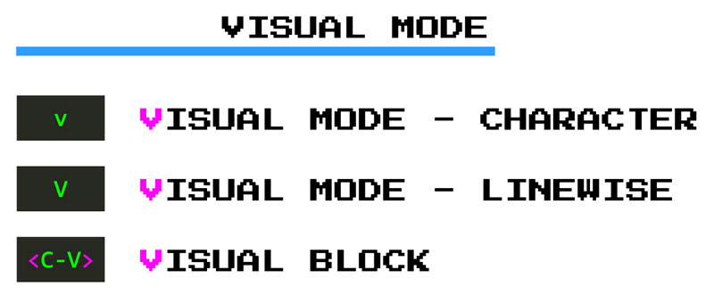
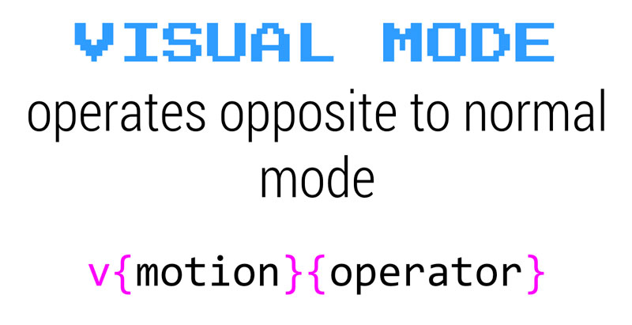
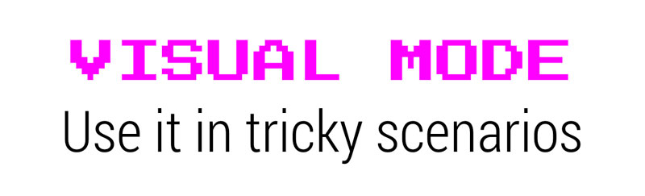

# Seleccionar texto en modo visual

**El modo visual es el equivalente de Vim a seleccionar texto con un mouse**. Pero en lugar de usar un mouse lento, se selecciona un texto confiando en los rápidos movimientos de Vim. A medida que seleccionas el texto en *modo Visual*, Vim resaltará tu selección proporcionando una ayuda visual. Esta retroalimentación visual hace que el *modo Visual* sea especialmente útil cuando sientas la necesidad de ser más preciso antes de realizar una acción.

Hay tres formas de iniciar el *modo Visual*:



- **`v`** para el modo visual en cuanto a **caracteres**. Este modo te permite seleccionar texto carácter a carácter.
- **`V`** para modo visual en **línea**. Este otro te permite seleccionar texto línea por línea.
- **`<Ctrl>-v`** para el modo visual por **bloques**. Este último modo te permite seleccionar texto usando bloques rectangulares

*El modo visual* puede ser muy útil para copiar y pegar cosas y cuando se opera en bloques de texto o código donde crees que necesitas esa retroalimentación visual adicional. Funciona de manera opuesta al modo *Normal*. En el *modo Normal*, primero se define el operador y luego un movimiento que representa un texto al que aplicar ese operador:

```text
{operator}{count}{motion}
```
En *modo Visual*, sin embargo, primero seleccionas el texto y **luego** escribe el operador:

```text
{trigger visual mode}{motion}{operator}
```


Así que, para eliminar las siguientes dos líneas:

```text
lines filled with mambo jambo.
that totally deserved to be deleted from existence.
```
Puedes escribir **`d2s`** en *modo Normal* o:

1. Ir al modo visual de líneas con **`V`** que selecciona la línea actual
2. Presiona **`j`** para bajar una línea y así seleccionarla también.
3. Ahora que has seleccionado las dos líneas escribe **`d`** y ya no estarán.

**El modo visual a menudo es más lento que usar comandos directamente en modo Normal, pero tendrás esa ayuda visual adicional que te garantiza que estás aplicando un comando exactamente donde deseas que se aplique**.


