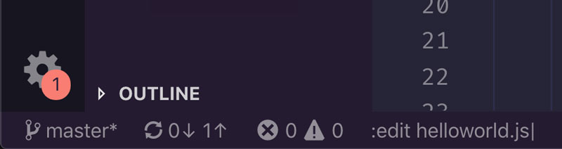

# Controla VSCode con el modo de línea de comandos

*El modo de línea de comandos* es otro modo más en Vim. Su característica definitoria es la capacidad de ejecutar **comandos Ex** (comandos que comienzan con **`:`**) y **patrones de búsqueda** (que comienzan con **`/`** y **`?`**). Ya hemos discutido la búsqueda en capítulos anteriores, por lo que nos centraremos en los comandos Ex en este.

**Los comandos Ex** son muy útiles y diversos: algunos te permiten configurar Vim (fi `:colorscheme`), otros te permiten realizar operaciones en todo el sistema (como crear un nuevo archivo con `:edit`), algunos otros acceden a comandos de shell externos (**`:!`**), y otros le permiten editar rápidamente múltiples líneas dentro de un documento con el movimiento de una mano (como `:delete`).

> **¿Por qué se llaman comandos ex?**
>
>¿¡Ex!? Un nombre extraño ¿no?. Se llaman comandos Ex porque parte del modo de línea de comandos de Vim se basa en un editor de línea aún más antiguo llamado Ex (también escrito por el creador de `vi` Bill Joy).

> **VSCodeVim solo admite un número muy limitado de comandos Ex, pero se pueden mejorar en gran medida integrando VSCodeVim con Neovim**. Este capítulo presentará el *modo de línea de comandos* , y dejaremos a Neovim hacia el final del libro cuando te hayas convertido en un practicante de Vim más experimentado. ¡Vamos a sumergirnos!

## Escribiendo un comando ex

Un comando Ex común es `:edit`. Te permite abrir o crear un archivo escribiendo:

```vim
:edit {relative-path-to-file}
```

**Observe el `:` antes de este comando**. A diferencia de los comandos del *modo Normal*, todos los comandos Ex comienzan con dos puntos. Escribir estos dos puntos activa el *modo de línea de comandos* y lo configura para ingresar un comando.

**Para escribir un comando Ex, escribir literalmente `:` seguido del nombre del comando** (por ejemplo `:edit`). Cuando escribes dos puntos y un comando, el comando se mostrará en la parte **inferior izquierda de la pantalla en la barra de estado de VSCode**. ¡Vamos a intentarlo!.

Crea un nuevo archivo escribiendo:

```vim
:edit helloworld.js
```

Deberías ver cómo, a medida que escribes dos puntos (**`:`**) y el nombre del comando, un cursor y letras se materializan en la parte inferior de la pantalla dentro de la barra de estado.



Cuando termines de escribir el comando y presiones `< Enter >`, se creará `helloworld.py` un nuevo archivo y VSCode lo abrirá para que puedas comenzar a codificar. Si el nombre de archivo que se especifica ya pertenece a un archivo existente, simplemente se abrirá ese archivo.

### `:edit` y caminos relativos

Cuando se usa el comando `:edit`, VSCodeVim se configura para usar rutas relativas en relación con el archivo abierto actualmente. No admite la finalización de TAB, por lo que es principalmente útil para crear nuevos archivos que comparten el lugar o viven cerca del archivo actual en el que estás trabajando.

Como de costumbre, Vim siempre trata de ahorrarte trabajo y esto no es diferente en el *modo de línea de comandos*: cada comando Ex tiene una versión abreviada que le permite activar un comando con solo unas pocas letras. Por ejemplo, la versión abreviada de **`:edit`** es **`:e`**. Pruebe la taquigrafía con nuestro ejemplo anterior y verás cómo obtienes los mismos resultados.

## Guardar y cerrar archivos

Un par de ingeniosos comandos Ex te permiten guardar y cerrar archivos con bastante rapidez:

- Usa **`:write`** (abreviatura **`:w`**) para guardar un archivo
- Usa **`:quit`** (abreviatura **`:q`**) para cerrar un archivo

Estos dos comandos son lo que me gusta llamar *comandos suaves*. Intentarán realizar la acción que describen pero, en algunas condiciones, fallarán y te pedirán que tomes más medidas. Por ejemplo, **`:write`** guardará un archivo pero fallará si el archivo no ha cambiado o si es de solo lectura. Del mismo modo **`:quit`**, cerrará un archivo pero fallará si el archivo tiene cambios sin guardar.

Si deseas ignorar cualquier queja y realizar una acción a toda costa, puedes combinar los comandos anteriores con **`!`**. Puedes pensar en el **`!`** como una forma de *forzar* un comando:

- Usa **`:write!`** (abreviatura **`:w!`**) para guardar un archivo incluso si ya se ha guardado o si es de solo lectura
- Usa **`:quit!`** (abreviatura **`:q!`**) para cerrar un archivo sin guardar.

Puedes combinar estos comandos para realizar múltiples acciones:

- Usa **`:wq`** para guardar y cerrar un archivo

O aplícalos a todos los archivos abiertos a la vez:

- Usa **`:wall`** (abreviatura **`:wa`**) para guardar todos los archivos
- Usa **`:qall`** (abreviatura **`:qa`**) para cerrar todos los archivos
- Usa **`:wqall`** (abreviatura **`:wqa`**) para guardar y cerrar todos los archivos
- Usa **`:qall!`** (abreviatura **`:qa!`**) para cerrar todos los archivos sin guardar

## Eliminar varias líneas a la vez

En capítulos anteriores aprendiste que Vim tiene un grupo de operadores que te permiten realizar cambios en el texto: **`d`**eliminar, **`c`**cambiar, **`y`**tirar, etc.

Vim también proporciona una serie de comandos Ex que realizan acciones equivalentes a los operadores del *modo Normal* pero con un caso de uso diferente en mente: operar en varias líneas a la vez.

Estos comandos Ex de edición de texto toman la siguiente forma:

```vim
:[range]command[options]
```

...donde **`range`** define un rango de líneas a las que aplicar el comando y **`options`** varían según el comando en sí. Por ejemplo, en el caso de **`:delete`** tenemos:

```text
:[range]d [register]
```

Donde **`register`** representa un registro en el que cortar lo que sea que eliminamos. Por ejemplo:

```text
:10,12d a
```

Elimina las líneas 10, 11 y 12 y las coloca dentro del registro **`a`**. Como puedes apreciar, los rangos generalmente se definen por sus extremos: una línea inicial y una línea final. Estos extremos pueden, a su vez, expresarse de diferentes maneras:

- Usar números (por ejemplo, **`:10,12d`** para eliminar las líneas 10, 11 y 12)
- Uso de compensaciones (por ejemplo, **`:10,+2d`** para eliminar las líneas 10, 11 y 12)
- Usar la línea actual representada por **`.`** (por ejemplo, **`:.,+2d`** para eliminar la línea actual y las dos siguientes)
- Utilizando **`%`** para representar todo el archivo (por ejemplo, **`:%d`** para eliminar todo el archivo)
- Utilizando **`0`** para representar el comienzo del archivo (por ejemplo, **`:0,+10d`** para eliminar las primeras 10 líneas)
- Utilizando **`$`** para representar el final del archivo (por ejemplo, **`:.,$d`** para eliminar de la línea actual al final del archivo)
- Si usas el *modo Visual* para hacer una selección de texto y luego escribes, **`:`** tu área de línea de comando se completará previamente con el siguiente gobbledygook: **`:'<,'>`** que es un rango especial que representa la selección actual de texto visual (por ejemplo, **`:'<,'>d`** significa eliminar la selección de texto actual).

¿Por qué usar comandos Ex en lugar de los comandos de modo normal que aprendimos en capítulos anteriores? Los comandos Ex son útiles porque te permiten aplicar un comando en un rango de líneas sin necesidad de mover el cursor a esa ubicación primero. **Siempre que necesites aplicar un cambio en varias líneas, considera usar comandos Ex**. Puede ser un enfoque más rápido que el *modo Normal*.

Otras alternativas de comandos Ex útiles a los comandos del *modo Normal* son `:yank`, `:put`, `:copy` y `:move` pero no son compatibles con VSCodeVim a menos que habilitemos la integración con Neovim.

## Repetir comandos Ex

Al igual que puedes repetir los comandos del *modo Normal* con el operador punto, los comandos Ex también tienen un comando repetidor. Escribe **`@:`** y repetirás el último comando Ex, a partir de ese momento puedes repetirlo nuevamente con **`@@`**.

## Sustituir texto

Otro comando Ex útil es `:substitute`. Te permite sustituir fragmentos arbitrarios de texto por otros de su elección. La forma de este comando es:

```vim
:[range]s/{pattern}/{substitute}/{flags}
```

Dónde:

- **`range`** define el rango en el que aplicaremos la sustitución
- **`pattern`** es un patrón de búsqueda que describe el texto que queremos cambiar. Como si **`/{pattern}`** fuera compatible con expresiones regulares.
- **`substitute`** es el texto que queremos sustituir
- **`flags`** establezcamos opciones que configuren la sustitución

Por ejemplo, el siguiente comando:

```vim
:s/led/gold
```

transmuta la primera aparición de `led` en la línea actual por `gold`.

Si queremos cambiar **todas las ocurrencias en la línea actual**, necesitamos agregar la bandera **`g`** o bandera *global* de la siguiente manera:

```vim
:s/led/gold/g
```

Y si queremos cambiar **todas las apariciones de un archivo completo**, solo tenemos que especificar el archivo completo como un rango con `%` esto es:

```vim
:%s/led/gold/g
```

Además de la bandera **`g`** podemos usar:

- **`i`** para búsquedas insensibles a mayúsculas y minúsculas
- **`c`** para confirmar todas y cada una de las sustituciones

El hecho de que podamos usar expresiones regulares con el comando **`:s`** abre la puerta a muchos casos de uso creativo. Por ejemplo, podríamos cambiar el nivel de sangría de todos los títulos en un archivo de reducción utilizando el siguiente comando **`:s`**:

```vim
:%s/^#//
```

Que se puede traducir como:

- **`%`** para todo el archivo
- **`s`** sustituir
- **`^#`** cualquiera **`#`** al comienzo de una línea (es decir, un encabezado en la reducción)
- **`//`** para un carácter vacío

### Global por defecto

A menudo, cuando hago una sustitución, quiero cambiar todas las ocurrencias de un patrón. Si tienes el mismo hábito, es posible que desees habilitar la opción *"Vim: Sustitute* como *global"* en tus preferencias de VSCodeVim. Esto habilitará la bandera `g` para todas las sustituciones y te ahorrará algo de escritura.

Cuando esta opción está activada, la bandera `g` cambia su significado al opuesto de lo que solía ser. A partir de entonces, agregarlo a un comando `:s` significará que solo se sustituirá la primera aparición en una línea.