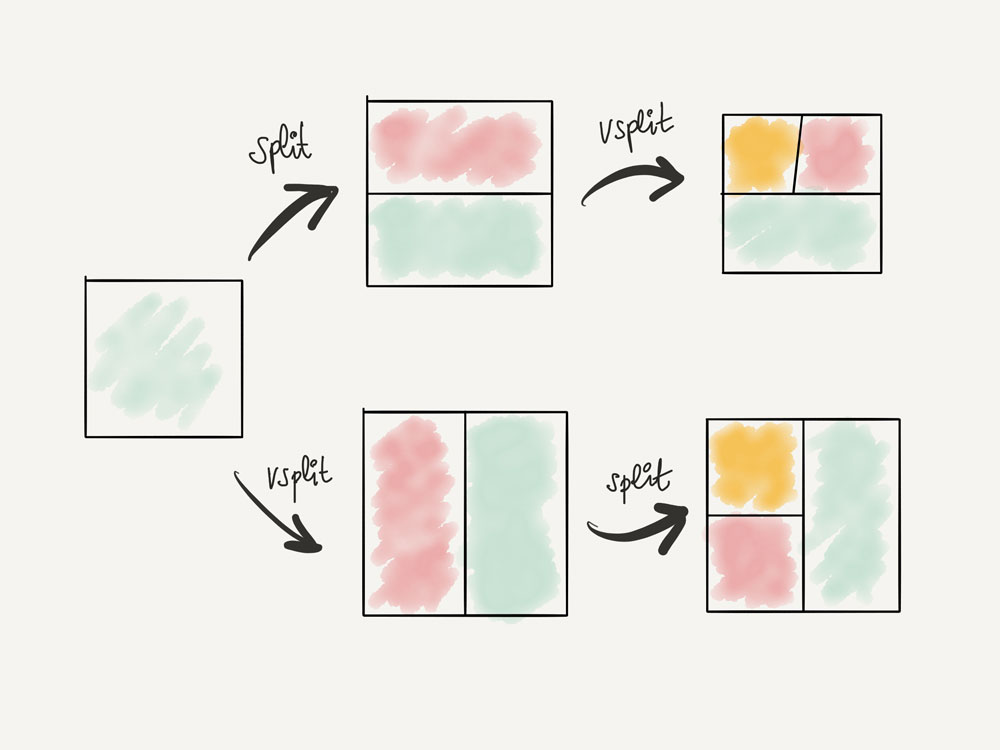

# Divisiones, pestañas y cambio entre ellas

Una gran característica en Vim es su gran soporte para divisiones y pestañas. Crear, redimensionar, reorganizar y mover entre divisiones y pestañas es increíblemente fácil y rápido en Vim. VSCodeVim ofrece un soporte aceptable para esta característica de Vim que, aunque no es tan buena como la de Vim, sigue siendo útil.

## Splits

Las divisiones son increíbles. Te permiten configurar tu espacio de trabajo en ventanas divididas vertical y horizontalmente:

- Usa el comando **`:sp {relative-path-to-file}`** para abrir un archivo en un **espacio** horizontal resaltado.
- Utiliza el **`:vsp {relative-path-to-file}`** para abrir un archivo en un **sp**lit **v**ertical.

Alternativamente, en lugar de estos comandos Ex, puedes usar:

- **`Ctrl-W S`** abrir una división horizontal (mnemónico **W**indow y **S**plit).
- **`Ctrl-W V`** para abrir una división vertical (mnemónico **W**indow **V**ertical).

El uso de cualquiera de estos comandos abrirá una división en el mismo archivo que estás editando actualmente. Entonces, después de crear la división, deberás escribir **`CTRL-P`** para abrir un nuevo archivo en esa división.

Puedes moverte entre divisiones usando **`CTRL-W`** + **`hjkl`**. *¿Estás actualmente en una división vertical y quieres moverte a la de la derecha?* Escribe **`CTRL-W`** luego **`l`** (el movimiento que normalmente usas para mover el cursor hacia la derecha). Tiene sentido, ¿no? Esta combinación de teclas funciona incluso al saltar de una ventana de código al explorador de archivos o un terminal integrado. **¡Genial!**

## Pestañas

En Visual Studio Code se pueden abrir varias pestañas dentro de una división. Con el fin de hacerlo:

- Usa **`:tabnew {file}`** para abrir un archivo en una pestaña nueva
- Usa **`:tabn`** (**`:tabnext`**) para ir a la pestaña **n**ext
- Usa **`:tabp`** (**`:tabprevious`**) para ir a la **p**estaña previa
- Usa **`:tabo`**( **`:tabonly`**) para cerrar todas las demás pestañas

Hay algunos [comandos Ex adicionales para trabajar con pestañas,](https://github.com/VSCodeVim/Vim/blob/master/ROADMAP.md#tabs) pero estos son definitivamente los más útiles.

### Todavía hay mucho que escribir ¡Lo sé!

Los comandos predeterminados para operar y moverse por divisiones y pestañas son un poco detallados y por tanto engorrosos e incómodos. En capítulos posteriores, aprenderás cómo puedes personalizarlos para usar divisiones y pestañas de manera más efectiva.