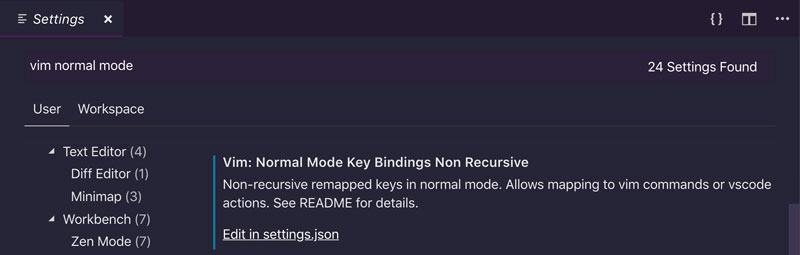

# Elevando tu flujo de trabajo con asignaciones personalizadas

Una de las mejores características de Vim es su personalización. Una forma sencilla de comenzar a personalizar Vim y una que tendrá el mayor efecto en tu codificación diaria es **crear asignaciones personalizadas**. Un mapeo en Vim es el equivalente a un atajo en otros editores pero con un fuerte enfoque en las melodías de teclas que son tan naturales para Vim.

## ¿Por qué mapeos personalizados?

Las asignaciones personalizadas son útiles por dos razones:

1. Te permiten personalizar Vim y adaptarlo a tu forma de trabajo mediante la creación de asignaciones personalizadas para las cosas que utilizas con frecuencia
2. Te permiten priorizar la funcionalidad de Vim acercándola a tu alcance. Mediante el uso de asignaciones personalizadas, puedes crear una jerarquía de comandos donde se puede acceder a los más útiles desde la productividad de su fila de inicio y a los menos útiles a través de combinaciones de teclas cómodas, pero más largas

## Crear asignaciones personalizadas

Puedes crear asignaciones personalizadas utilizando las preferencias de Visual Studio Code:

1. Abre la paleta de comandos con **`CTRL-SHIFT-P`**
2. Escribe *Preferences*
3. Selecciona *Preferences: Open User Settings* 
4. Escribe **`vim`**

Y se filtrarán tus preferencias de Visual Studio Code para mostrar solo las relacionadas con VSCodeVim. Ahora puedes usar la siguiente configuración para agregar tus asignaciones personalizadas en diferentes modos:

- *Normal Mode Key Bindings Non Recursive* para el modo Normal
- *Visual Mode Key Bindings Non Recursive* para el modo Visual
- *Insert Mode Key Bindings Non Recursive* para el modo Inserción

Tener diferentes asignaciones para diferentes modos tiene sentido porque cada modo es una pizarra limpia donde puedes redefinir asignaciones para realizar tareas específicas de ese modo. Eso te permite reutilizar las teclas del estado real del teclado en cada modo y tener una funcionalidad potente al alcande de tus dedos.

Ten en cuenta que esta configuración solo se puede cambiar desde la versión de la configuración en formato **`json`**:



Un mapeo personalizado normalmente toma la siguiente forma:

```json
{
  "vim.insertModeKeyBindingsNonRecursive": [
    {
      "before": ["j", "k"],
      "after": ["<ESC>"]
    }
  ],
}
```

Dónde:

- **before** es la secuencia de comandos que se escriben.
- **after** es a qué se asignan los comandos anteriores y qué se ejecuta cuando los escribes.

En el ejemplo anterior, cada vez que escribimos la secuencia **`jk`** en *modo Insertar* será equivalente a escribir **`<ESC>`** y, por lo tanto, nos llevará de vuelta al *modo Normal*. Esta es una gran asignación personalizada que hace una tarea sin fisuras muy común, ya que ambos **`j`** y **`k`** están en la fila principal del teclado y simplemente debajo de tu mano derecha.

Agrega esta asignación a tu configuración y verás que surte efecto tan pronto como guardes tu configuración. Ahora intenta ir al *modo Insertar* y escribe **`jk`** en una sucesión rápida. **`ijk`**, **`ijk`**, **`ijk`**...  Debe fluir suavemente como una lenta corriente o como mantequilla caliente sobre una tostada.

## Pautas para crear asignaciones personalizadas

La capacidad de crear asignaciones personalizadas te brinda mucha libertad y flexibilidad para definir cómo interactuar con Visual Studio Code. Pero debido a que no hay nada que lo detenga para hacer lo que quiera, puedes terminar pegándote un tiro en el pie. Aquí hay algunas reglas que te guiarán cuando crees tus propios mapeos personalizados y guardes esos preciosos dedos tuyos:

- En general, usa la tecla **líder** para definir tus asignaciones personalizadas. La clave **líder** es una tecla especial en Vim cuyo propósito es actuar como un espacio de nombres o puerta de enlace a las asignaciones definidas por el usuario. De manera predeterminada, la tecla líder se asigna a la tecla de barra diagonal inversa **`\`**.
- Si hay algo en tu flujo de trabajo que usas todo el tiempo, entonces está bien (de hecho se recomienda) sobrescribir un enlace Vim predeterminado que no sea muy útil. Esta es la excepción a la regla.
- Crea asignaciones que sean fáciles de recordar. Sigue la tradición de Vim y confía en la mnemotecnia. (¿Recuerda? `c` Para **c**ambio, `d` para **d**elete, y así...)

Si estas reglas parecen demasiado abstractas, no te preocupes, en las siguientes secciones las haremos más prácticas ya que definimos una serie de asignaciones personalizadas que puedes agregar a tu propia configuración VSCodeVim.

## Personalizar la tecla líder

Puedes cambiar la clave de líder a algo más fácil de escribir que la barra invertida **`\`** (odio tener teclas importantes asociadas a mis dedos meñiques. La tecla más indicada es posiblemente es la barra espaciadora, que se puede utilizar con ambas manos.

Vea a sus preferencias de VSCode y actualiza la siguiente configuración:

```json
{
"vim.leader": "<Space>",
}
```

De ahora en adelante, cada vez que veas un mapeo personalizado que se refiera a **`<leader>`**, debes traducirlo en tu cabeza por **`<Space>`**.

## Algunas buenas asignaciones personalizadas

Aquí hay algunos otros excelentes ejemplos de mapeos útiles:

### Moverse hacia arriba y hacia abajo más rápido en modo normal

Estas asignaciones te permiten moverte hacia arriba y abajo más rápido en *modo Normal* (aunque son igual de útiles en *modo Visual* ):

```json
{
  "vim.normalModeKeyBindingsNonRecursive": [
    {
      "before": ["J"],
      "after": ["5", "j"]
    },
    {
      "before": ["K"],
      "after": ["5", "k"]
    },
  ]
}
```

De ahora en adelante podrás usar:

- **`J`** bajar más rápido
- **`K`** subir más rápido

Esto coincide perfectamente con la idea de Vim de que los comandos en mayúsculas sean versiones *más fuertes* de los comandos en minúsculas. Es decir, **`J`** te permite moverte más rápido que **`j`** y **`K`** más rápido que **`k`**.

Aquí hemos sobrescrito dos enlaces predeterminados de Vim porque navegar por el código hacia arriba y hacia abajo; es algo que harás todo el tiempo. Mientras que **`J`**(unir líneas), aunque es útil, es algo que solo haces de vez en cuando. **`K`** se usa para la búsqueda de palabras clave pero aún no se ha implementado en VSCodeVim.

### Seguir uniendo líneas

Unir líneas sigue siendo útil, así que vamos a mantenerlo. Aunque rebajaremos su importancia en la jerarquía haciéndolo un poco más difícil de escribir.

Actualice su configuración de VSCodeVim para incluir esta nueva asignación:

```json
{
  "vim.normalModeKeyBindingsNonRecursive": [
    {
      "before": ["<Leader>", "j"],
      "after": ["J"]
    },
  ]
}
```

Entonces, cada vez que escribas **`<Leader>j`**, Vim lo traducirá por **`J`** y unirá dos líneas. ¡Pruébalo!

**`<Leader>j`** no es tan rápido como simplemente escribir, **`J`** pero es lo suficientemente bueno en función de la frecuencia con la que unirás líneas. La mnemónica en este caso es **j**oin.

### Cambio más fácil entre ventanas divididas

Cambiar ventanas divididas es algo que harás todo el tiempo, así que prueba estos enlaces:

```json
{
  "vim.normalModeKeyBindingsNonRecursive": [
    {
      "before": ["<C-h>"],
      "after": ["<C-w>", "h"]
    },
    {
      "before": ["<C-j>"],
      "after": ["<C-w>", "j"]
    },
    {
      "before": ["<C-k>"],
      "after": ["<C-w>", "k"]
    },
    {
      "before": ["<C-l>"],
      "after": ["<C-w>", "l"]
    }]
}
```

Te harán mucho más rápido y ágil cuando atravieses divisiones porque requieren una pulsación de tecla menos.

### Manejo de pestañas más fácil

La única forma de interactuar con pestañas en VSCodeVim es a través de comandos que requieren que escribas dos puntos seguidos de un montón de letras.

Podemos hacerlo mejor:

```json
{
  "vim.normalModeKeyBindingsNonRecursive": [
    {
      "before": ["<Leader>", "t", "t"],
      "commands": [":tabnew"]
    },
    {
      "before": ["<Leader>", "t", "n"],
      "commands": [":tabnext"]
    },
    {
      "before": ["<Leader>", "t", "p"],
      "commands": [":tabprev"]
    },
    {
      "before": ["<Leader>", "t", "o"],
      "commands": [":tabo"]
    }]
}
```

Aprovechando la tecla **`<Leader>`**, ahora podemos abrir nuevas pestañas, movernos y cerrar todas las pestañas excepto la actual.

**¿Notaste algo diferente acerca de estas asignaciones personalizadas?**

¡Exactamente! Utiliza una sintaxis ligeramente diferente al asignar teclas a comandos. En lugar de usar **`before`** y **`after`**. Usamos **`before`** y **`commands`**. **`commands`** representa los comandos Ex o los comandos nativos de Visual Studio que deben ejecutarse cada vez que escribimos la asignación de teclas definida por **`before`**.

### Limpieza de texto resaltado

Cuando busques patrones en Vim utilizando los comandos **`/{pattern}`** y **`?{pattern}`**, se resaltarán los patrones coincidentes. Para eliminar los resaltados, puedes usar el comando **`:noh`**(*sin resaltado*).

Esta es una tarea tan común que prefiero la siguiente asignación:

```json
{
  "vim.normalModeKeyBindingsNonRecursive": [
    {
      "before": ["<Leader>", "/"],
      "commands": [":noh"]
    }]
}
```

Ahora puedes escribir **`<Leader>/`** y deshacerte de los resaltados hasta tu próxima búsqueda. El mnemónico es el **/** que normalmente se usa para buscar un patrón. Por lo tanto, puede pensar **`/{pattern}`** en algo que haces para comenzar una búsqueda y **`/`** como algo que haces cuando terminas una búsqueda.

## Crear asignaciones personalizadas para acciones vscode

Otra cosa genial que puedes hacer con VSCode es usar asignaciones de Vim que activen los comandos nativos de Visual Studio Code. Por ejemplo, el siguiente enlace:

```json
{
  "vim.normalModeKeyBindingsNonRecursive": [
    {
      "before": ["leader", "w"],
      "commands": [
          "workbench.action.files.save",
      ]
    }
}
```

Vamos a guardar un archivo mediante la **`w`** activación de la acción de VSCode `"workbench.action.files.save"`.

> ### ¿Cómo encontrar los nombres de los comandos?
>
> Descubrir qué comando hace qué en VSCode no es realmente evidente, es decir, si hubiera querido saber que guardar cosas en VSCode es `workbench.action.files.save` difícilmente lo habría adivinado. Entonces, ¿dónde puedes encontrar esa información oscura?
>
> Abre la paleta de comandos, escribe *keyboard* y selecciona *Preferences: Open Keyboard Shortcuts*. Allí encontrarás todos los comandos que están disponibles dentro de VSCode, incluido su nombre de comando completo. Úsalos siempre que desees crear asignaciones personalizadas para acciones nativas de VSCode.
>
> **Advertencia** : cuando buscas un comando, el nombre completo del comando solo se mostrará si la condición del filtro es parte del nombre. Si el nombre del comando no se muestra después del filtrado, puedes pasar el mouse sobre el nombre del comando y una información sobre las herramientas revelará su nombre completo.

Veamos otro ejemplo. Hay cuatro características en VSCode que encuentro extremadamente útiles:

- La **paleta de comandos** (`CTRL-SHIFT-P`)
- **Ir al archivo** (`CTRL-P`)
- **Ir al símbolo en el archivo** (`CTRL-SHIFT-O`)
- **Ir al símbolo en el espacio de trabajo** (`CTRL-T`)

La *paleta de comandos* y el *símbolo Ir al archivo* son particularmente difíciles de escribir, así que creemos una asignación personalizada para mantener nuestras muñecas saludables:

```json
{
  "vim.normalModeKeyBindingsNonRecursive": [
    {
      "before": ["<Leader>", "p"],
      "commands": [
          "workbench.action.showCommands",
      ]
    },
    {
      "before": ["<Leader>", "t"],
      "commands": [
          "workbench.action.gotoSymbol",
      ]
    }
  ]
}
```

Ahora ya no necesitas retorcer los dedos para abrir la *paleta de comandos* o *ir al símbolo*. Simplemente escribe **`<Leader>p`** y **`<Leader>t`** respectivamente y accederás rápidamente a cualquiera de estos paneles. Yihoo!

Hay muchas más asignaciones interesantes y útiles en la [documentación de VSCodeVim. ¡Échale un vistazo!](https://github.com/VSCodeVim/Vim#key-remapping). Pero recuerda ser crítico. Antes de agregar un mapeo personalizado en tu configuración de VSCodeVim, considera si ofrece un mejor flujo de trabajo que el que usas actualmente. Nunca agregues cosas a tu configuración a ciegas.

**Una parte importante de ser más eficaz con Vim es tener en cuenta tu flujo de trabajo de desarrollo. Revisando tu configuración de Vim de vez en cuando, y agregando nuevas asignaciones que mejoren tu forma de trabajar. Por lo tanto, tenlo en cuenta a partir de ahora y mantén tu configuración Vim muy nítida.**